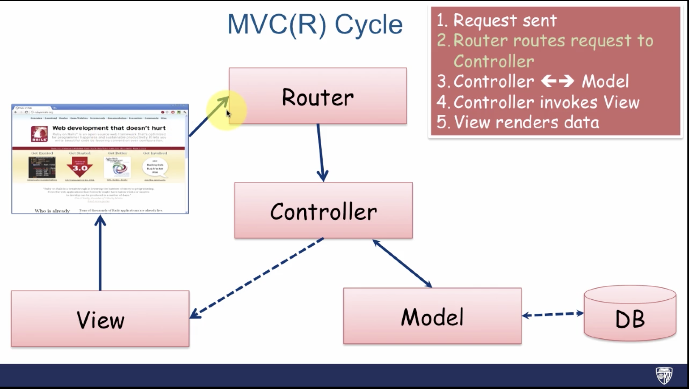

# Welcome to RobinXYuan Rails Notebook

## Core Concepts

### Start an Application

### Controllers and Views

#### Create Controllers

```ruby
> rails g controller greeter hello
```

Then, go to ```project_dir/views/greeter/hello.html.erb```

*erb* => Embeded Ruby

ERB is a templating library (Similary to JSP, for example) that lets you embeded Ruby into your HTML file.

#### Change Views

Then, in the *hello.html.erb* file, write

```ruby
<% random_names = ["Alex", "Joe", "Michael"] %>
<h1>Greetings, <%= random.names.sample %></h1>
<p>The time now is <%= Time.now %></p>
```

<% ...Ruby codes... %> - Evaluate Ruby code
<%= ...Ruby codes... %> - Output evaluated Ruby code

### Routes

#### Routing

Before the *Controller* can orchestrate where the web request goes - the web request needs to get routed to the Controller

#### MCV(R) Cycle

1. Request sent
2. Router routes request to Controller
3. Controller <=> Model
4. Controller invokes View
5. View renders data



All the routes need to be specified(either generated by rails generators or manually) in the ```config/routes.rb``` file.

#### New config/routes.rb

```ruby
Rails.application.routes.draw do 
	# get 'greeter/hello'

	# SAME AS ABOVE
	# 						Controller#Action
	get 'greeter/hello' => "greeter#hello"
	get 'greeter/goodbye'
```

#### Rake
- Ruby's build language
	- Ruby's make
	- No XML - written entirely in Ruby
- Rails uses rake to automate app-related tasks
	- Database, running tests, etc.
- To see a list of rake tasks for your app:
	- ```rake --tasks```

##### Individual Rake Task

- You can zero-in on an individual rake task and what it does with a --describe flag
- ```rake --describe task_name```

## Diving Deeper into Rails

### Moving Business Logic Out of View


